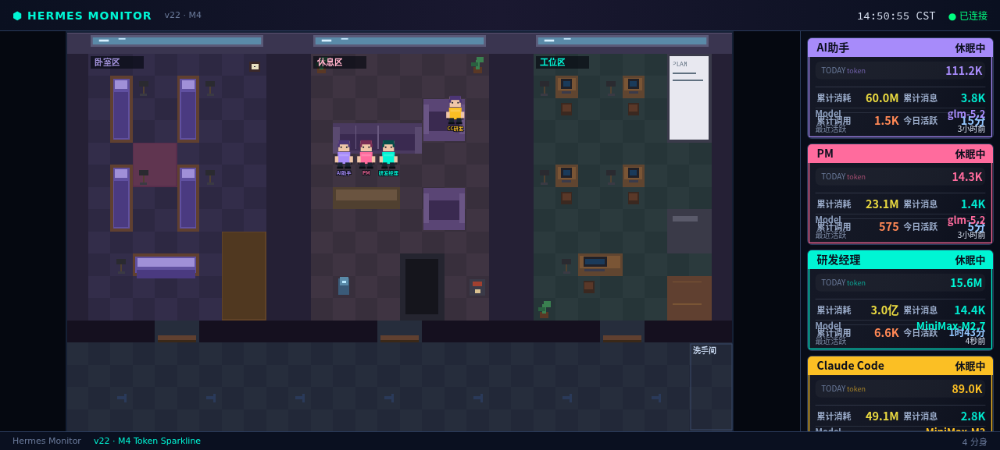

# Hermes Monitor

Pixel-style multi-persona AI assistant real-time monitoring dashboard. Supports four personas (default / PM / Tech Lead / CC Dev) with status tracking, behavior visualization, and Metrics statistics.


<!-- Replace with your own screenshot: /tmp/hermes_monitor_screenshot.png -->

## Features

### 🖥️ Pixel Office Visualization
- Real-time rendering of four personas at workstations, beds, rest areas
- Dynamic character behaviors: coding, reviewing, meetings, resting, sleeping
- Day/night lighting system with work hours (08:00-21:00) and sleep window (21:00-08:00)
- Coordinated multi-persona events: code reviews, syncs, bug fixes

### 📊 Multi-Persona Support
| Persona | Profile ID | Description |
|---------|-----------|-------------|
| Default | `default` | Default gateway |
| PM | `pm` | Product Manager persona |
| Tech Lead | `tech` | R&D Manager persona |
| CC Dev | `claude-code` | Claude Code CLI persona |

### 📈 Metrics Dashboard
- **Dual Counter System**: Today's data + historical cumulative separately
- **Token Tracking**: Input/output/reasoning tokens per persona
- **Activity Status**: Active minutes, last active time, online/offline/sleeping
- **Auto Day Reset**: Beijing time 00:00 auto-resets today's data, preserves history

### 🔄 CC Dev Reverse Proxy
- Port 80 forwarding to Volcano Ark Coding API
- Automatic metrics ingestion to monitor panel
- Claude Code CLI compatible

## System Architecture

```
┌──────────────────────────────────────────────────────────┐
│                    Browser (Port 8899)                    │
│   pixel-office.js (Pixel Canvas)                         │
│   server-panel.js (Right-side Metrics Panel)             │
└──────────────────────┬───────────────────────────────────┘
                       │ HTTP / WebSocket
┌──────────────────────▼───────────────────────────────────┐
│   monitor_server.py (FastAPI, Port 8899)                 │
│   ├── /api/state          Real-time persona status      │
│   ├── /api/metrics/daily  Today/cumulative metrics      │
│   └── /api/metrics/ingest Hermes push metrics           │
└──────────────────────┬───────────────────────────────────┘
                       │
          ┌────────────┴────────────┐
          │                         │
   ┌──────▼──────┐        ┌────────▼────────┐
   │ Hermes      │        │ hermes_         │
   │ Gateway     │        │ collector.py    │
   │ (WS API)    │        │ (Collector)     │
   └─────────────┘        └─────────────────┘

┌──────────────────────────────────────────────────────────┐
│   claude-proxy-server-80.py (Port 80)                   │
│   Claude Code CLI → Volcano Ark / Anthropic API          │
└──────────────────────────────────────────────────────────┘
```

## Quick Start

### Prerequisites

- Python 3.11+
- Linux server (tested on CentOS / Alibaba Cloud Linux)
- `pip install fastapi uvicorn websockets aiohttp`

### 1. Install Dependencies

```bash
pip install fastapi uvicorn websockets aiohttp
```

### 2. Configure

```bash
# Copy environment template
cp .env.template .env
# Edit .env with your API keys

# Or set environment variables directly
export ALIBABA_CODING_PLAN_API_KEY=your_key_here
export FEISHU_APP_ID=cli_xxx
export FEISHU_APP_SECRET=your_secret
```

### 3. Start Services

```bash
cd monitor

# Start backend service (Port 8899)
python3 backend/monitor_server.py &

# Start CC Dev reverse proxy (Port 80, optional)
python3 claude-proxy-server-80.py &

# Access dashboard
# http://localhost:8899/
```

### 4. Configure Hermes Reporting

On the server running Hermes Agent, configure metrics reporting:

```bash
export ANTHROPIC_INGEST_URL=http://<monitor-ip>:8899/api/metrics/ingest
```

## Directory Structure

```
hermes-monitor/
├── monitor/
│   ├── backend/
│   │   ├── monitor_server.py      # Monitor backend (FastAPI)
│   │   └── hermes_collector.py    # Hermes data collector
│   ├── frontend/
│   │   ├── index.html             # Dashboard entry
│   │   ├── pixel-office.js        # Pixel canvas + behavior logic
│   │   ├── server-panel.js        # Right-side metrics panel
│   │   └── data/
│   │       ├── seats.json         # Workstation/bed coordinates
│   │       └── tilemap.json       # Map tile data
│   ├── claude-proxy-server-80.py  # CC Dev reverse proxy
│   ├── external_metrics.json      # Metrics data (optional)
│   └── SPEC-*.md                  # Design documents
├── configs/
│   └── profiles/                   # Persona config templates
│       ├── tech.yaml
│       └── pm.yaml
├── scripts/
│   └── restore.sh                  # Data recovery script
├── .env.template
├── config.yaml.template
└── README.md
```

## CC Dev Reverse Proxy

When using Claude Code CLI as the dev persona, start the reverse proxy:

```bash
# On monitor server
python3 monitor/claude-proxy-server-80.py &

# On Claude Code server
export ANTHROPIC_BASE_URL=http://<monitor-server-ip>:80
export ANTHROPIC_API_KEY=sk-ant-xxxxx
```

The proxy will:
1. Receive Claude Code CLI requests
2. Forward to configured `ANTHROPIC_UPSTREAM_URL` (default: Volcano Ark)
3. Log call counts and token usage
4. Report to `ANTHROPIC_INGEST_URL`

## Deployment

### Docker (Recommended)

```yaml
# docker-compose.yml
version: '3.8'
services:
  hermes-monitor:
    image: python:3.11-slim
    command: bash -c "pip install fastapi uvicorn websockets aiohttp && python backend/monitor_server.py"
    ports:
      - "8899:8899"
      - "80:80"
    volumes:
      - ./monitor:/app/monitor
    restart: unless-stopped
```

```bash
docker-compose up -d
```

### Systemd Service

```ini
# /etc/systemd/system/hermes-monitor.service
[Unit]
Description=Hermes Monitor
After=network.target

[Service]
Type=simple
User=root
WorkingDirectory=/root/.hermes/monitor
ExecStart=/usr/bin/python3 backend/monitor_server.py
Restart=always

[Install]
WantedBy=multi-user.target
```

```bash
systemctl enable hermes-monitor
systemctl start hermes-monitor
```

## FAQ

**Q: All panel data shows 0?**
A: Check if Hermes is configured with `ANTHROPIC_INGEST_URL` pointing to the monitor panel. Ensure port 8899 is reachable.

**Q: CC proxy connection failed?**
A: Verify port 80 is not occupied. Check if upstream `ANTHROPIC_UPSTREAM_URL` is reachable.

**Q: How to add new personas?**
A: Register in `pixel-office.js`: `COLORS` / `_profileOrder` / `_profileName`. Assign workstation and bed coordinates in `seats.json`.

## Development

```bash
# View all SPEC documents
ls monitor/SPEC-*.md

# SPEC numbering rules
# v19 → v20 → v21 → v22
# v21-M1 ~ v21-M5 are v21 sub-milestones
```

## License

MIT License - see [LICENSE](LICENSE) file
