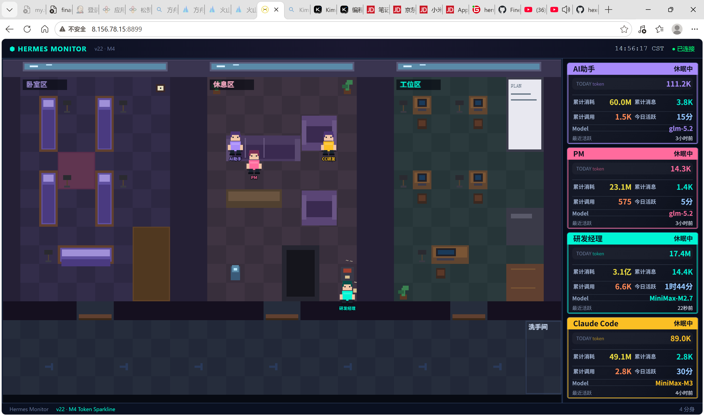
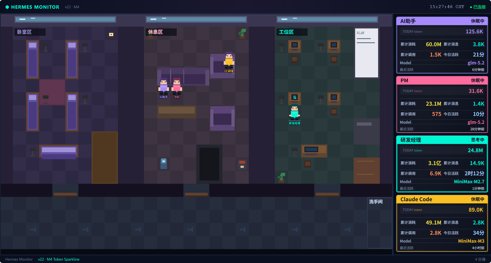
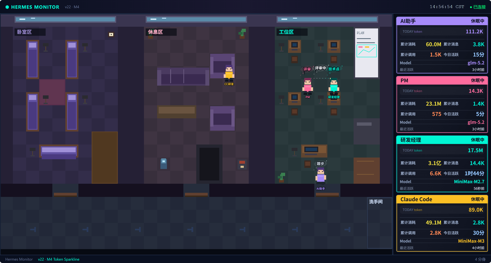

# Hermes 监控中心

像素风格多分身 AI 助手实时监控面板。支持四个分身（默认助手 / PM / 研发经理 / CC研发）状态追踪、行为可视化、Metrics 统计。


## 功能特性

### 🖥️ 像素画布可视化
实时渲染四个分身的工位、床位、休息区动态。角色行为动画：编码、评审、会议、休息、睡觉。昼夜灯光系统：工作时段（08:00-21:00）、睡眠窗口（21:00-08:00）。

**单人事件 — 踱步：**


**单人事件 — 喝咖啡：**


**工作中：**


### 🤝 联合多人事件
评审、对齐、调 Bug — 多个分身实时互动协作。

**多人评审中：**


### 📊 多分身支持

| 分身 | Profile ID | 说明 |
|------|-----------|------|
| 默认助手 | `default` | 默认 gateway |
| PM | `pm` | 产品经理分身 |
| 研发经理 | `tech` | 研发经理分身 |
| CC研发 | `claude-code` | Claude Code CLI 模拟分身 |

### 📈 指标面板
- **双口径统计**：今日数据 + 历史累计分别统计
- **Token 追踪**：每个分身的输入/输出/推理 token
- **活跃状态**：活跃分钟数、最后活跃时间、在线/离线/睡眠
- **跨天自动重置**：北京时间 00:00 自动清零今日数据，保留历史累计

### 🔄 CC研发中转代理
- 端口 80 转发到火山方舟 Coding API
- 自动上报 metrics 到监控面板
- 兼容 Claude Code CLI

## 系统架构

```
┌──────────────────────────────────────────────────────────┐
│                    浏览器 (端口 8899)                     │
│   pixel-office.js (像素画布)                             │
│   server-panel.js (右侧指标面板)                          │
└──────────────────────┬───────────────────────────────────┘
                       │ HTTP / WebSocket
┌──────────────────────▼───────────────────────────────────┐
│   monitor_server.py (FastAPI, 端口 8899)                 │
│   ├── /api/state          实时分身状态                   │
│   ├── /api/metrics/daily  今日/累计指标                  │
│   └── /api/metrics/ingest Hermes push 指标               │
└──────────────────────┬───────────────────────────────────┘
                       │
          ┌────────────┴────────────┐
          │                         │
   ┌──────▼──────┐        ┌────────▼────────┐
   │ Hermes      │        │ hermes_        │
   │ Gateway     │        │ collector.py   │
   │ (WS API)    │        │ (采集器)        │
   └─────────────┘        └─────────────────┘

┌──────────────────────────────────────────────────────────┐
│   claude-proxy-server-80.py (端口 80)                   │
│   Claude Code CLI → 火山方舟 / Anthropic API             │
└──────────────────────────────────────────────────────────┘
```

## 快速开始

### 环境要求

- Python 3.11+
- Linux 服务器（测试于 CentOS / 阿里云 Linux）
- `pip install fastapi uvicorn websockets aiohttp`

### 1. 安装依赖

```bash
pip install fastapi uvicorn websockets aiohttp
```

### 2. 配置

```bash
# 复制环境变量模板
cp .env.template .env
# 编辑 .env 填入你的 API Key

# 或直接设置环境变量
export ALIBABA_CODING_PLAN_API_KEY=your_key_here
export FEISHU_APP_ID=cli_xxx
export FEISHU_APP_SECRET=your_secret
```

### 3. 启动服务

```bash
cd monitor

# 启动后端服务（端口 8899）
python3 backend/monitor_server.py &

# 启动 CC研发中转代理（端口 80，可选）
python3 claude-proxy-server-80.py &

# 访问面板
# http://localhost:8899/
```

### 4. 配置 Hermes 上报

在你运行 Hermes Agent 的服务器上，配置 metrics 上报：

```bash
export ANTHROPIC_INGEST_URL=http://<monitor-ip>:8899/api/metrics/ingest
```

## 目录结构

```
hermes-monitor/
├── monitor/
│   ├── backend/
│   │   ├── monitor_server.py      # 监控后端（FastAPI）
│   │   └── hermes_collector.py    # Hermes 数据采集器
│   ├── frontend/
│   │   ├── index.html             # 面板入口
│   │   ├── pixel-office.js        # 像素画布 + 行为逻辑
│   │   ├── server-panel.js        # 右侧指标面板
│   │   └── data/
│   │       ├── seats.json         # 工位/床位坐标
│   │       └── tilemap.json       # 地图瓦片数据
│   ├── claude-proxy-server-80.py  # CC研发中转代理
│   ├── external_metrics.json       # 指标数据（可选提交）
│   └── SPEC-*.md                  # 详细设计文档
├── configs/
│   └── profiles/                  # 分身配置模板
│       ├── tech.yaml
│       └── pm.yaml
├── scripts/
│   └── restore.sh                  # 数据恢复脚本
├── docs/
│   ├── screenshot.png             # 主面板截图
│   └── features/                  # 功能截图
│       ├── 01-walking-event.png  # 踱步事件
│       ├── 02-coffee-event.png   # 喝咖啡事件
│       ├── 03-review-event.png   # 评审事件
│       └── 04-working.png         # 工作中
├── .env.template
├── config.yaml.template
└── README.md
```

## CC研发 中转代理

如果你使用 Claude Code CLI 作为研发分身，需要启动中转代理：

```bash
# 在监控服务器上启动代理（端口 80）
python3 monitor/claude-proxy-server-80.py &

# 在 Claude Code 服务器上配置
export ANTHROPIC_BASE_URL=http://<monitor-server-ip>:80
export ANTHROPIC_API_KEY=sk-ant-xxxxx
```

代理会：
1. 接收 Claude Code CLI 请求
2. 转发到配置的 `ANTHROPIC_UPSTREAM_URL`（默认火山方舟）
3. 记录调用次数和 token 消耗
4. 上报到 `ANTHROPIC_INGEST_URL`

## 部署方式

### Docker（推荐）

```yaml
# docker-compose.yml
version: '3.8'
services:
  hermes-monitor:
    image: python:3.11-slim
    command: bash -c "pip install fastapi uvicorn websockets aiohttp && python backend/monitor_server.py"
    ports:
      - "8899:8899"
      - "80:80"
    volumes:
      - ./monitor:/app/monitor
    restart: unless-stopped
```

```bash
docker-compose up -d
```

### Systemd 服务

```ini
# /etc/systemd/system/hermes-monitor.service
[Unit]
Description=Hermes Monitor
After=network.target

[Service]
Type=simple
User=root
WorkingDirectory=/root/.hermes/monitor
ExecStart=/usr/bin/python3 backend/monitor_server.py
Restart=always

[Install]
WantedBy=multi-user.target
```

```bash
systemctl enable hermes-monitor
systemctl start hermes-monitor
```

## 常见问题

**Q: 面板数据全部为 0？**
A: 检查 Hermes 是否配置了 `ANTHROPIC_INGEST_URL` 上报到监控面板，确认监控服务端口 8899 可达。

**Q: CC研发代理无法连接？**
A: 确认端口 80 未被占用，上游 `ANTHROPIC_UPSTREAM_URL` 可达。

**Q: 如何添加新的分身？**
A: 在 `pixel-office.js` 的 `COLORS` / `_profileOrder` / `_profileName` 中注册，并在 `seats.json` 中分配工位和床位坐标。

## 开发相关

```bash
# 查看所有 SPEC 文档
ls monitor/SPEC-*.md

# SPEC 编号规则
# v19 → v20 → v21 → v22
# v21-M1 ~ v21-M5 为 v21 的子里程碑
```

## License

MIT License - 详见 [LICENSE](LICENSE) 文件
